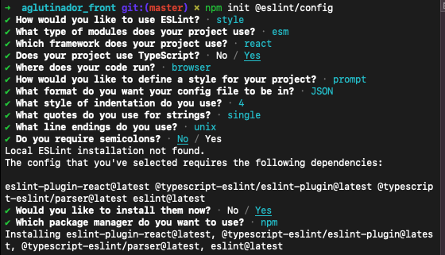

# ReactJs

## Create new project:

npx create-react-app alura-studies

## Add template

npx create-react-app --template typescript alura-studies

## Set to user npm

npx create-react-app --template typescript --use-npm alura-studies

## CSS

## Lib sass

npm install --save-dev sass

## Lib [css modules](https://www.npmjs.com/package/typescript-plugin-css-modules)

npm install -D typescript-plugin-css-modules sass

> add on tsconfig.json

    "compilerOptions": {
        "plugins": [{ "name": "typescript-plugin-css-modules" }]
    }

## [Normalize/Css reset](https://create-react-app.dev/docs/adding-css-reset)

> a anotação @import-normalize não está funcionando, usar npm:

npm i normalize.css

## React-Icons

npm i react-icons

## Classnames

npm i classnames

> Serve para usar css modules e ter classes condicionais
>
> > Sem classnames:
> >
> > `className={\'${styles.filters__filter} ${filter === option.id ? styles["filters__filter--ativo"] : ""}'}`

> > Com classnames:
> >
> > `className={classNames({ [styles.filters__filter]: true, [styles["filters__filter--ativo"]]: filter === option.id })}`

## ESLINT

Após configurar, executar

> npx eslint ./src --fix

## Router

Configuração de rotas

> npm i react-router-dom
